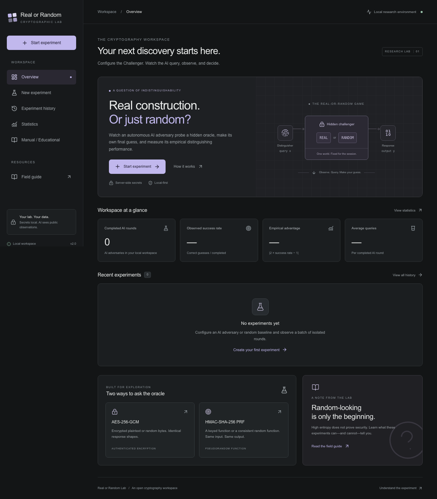

# Real or Random Lab

A local-first cryptography laboratory where an autonomous AI adversary chooses oracle queries and independently guesses REAL or RANDOM. Configure and observe isolated rounds, compare a random-guessing baseline, and inspect empirical results. Manual educational mode remains available.



## Run locally

Use Node.js 22.13+ (Node 24 LTS recommended) and pnpm 11. A C/C++ build toolchain and Python may be needed to compile the SQLite driver on your platform.

```bash
pnpm install
pnpm setup
pnpm dev
```

Open [localhost:3000](http://127.0.0.1:3000). The development server binds to loopback. The command starts both Next.js and the SQLite-backed adversary worker. Manual and random-baseline modes work offline after installation. AI mode sends public specifications and oracle observations to OpenAI; keys and hidden worlds remain local.

The setup command applies the committed SQLite migration and prepares a persistent development master key. Migrations also run automatically when the database opens; explicitly run them with `pnpm db:migrate`.

### Configuration and keeping data

Copy `.env.example` to `.env.local` to customize configuration. Next.js loads this file automatically.

| Setting | Behavior |
| --- | --- |
| `DATABASE_URL` | Defaults to `file:./data/ror.db`. SQLite file on this machine. |
| `ROR_MASTER_KEY` | Exactly 32 bytes encoded as 64 hex characters or canonical Base64. Required in production. |
| `OPENAI_API_KEY` | Server-only OpenAI API credential; optional for manual/baseline use. |
| `OPENAI_ADVERSARY_MODEL` | Default Responses API model ID; can be selected per batch. |
| `ROR_DEV_KEY_FILE` | Optional development key path; defaults to `data/.master-key`. |

Without an environment master key, development creates `data/.master-key` with owner-only permissions. Keep this file together with your database backups. Losing or changing the key makes existing secret records unreadable. The database, keys, local environment files, and test artifacts are excluded from Git. Never commit them.

`ROR_UNSAFE_DEBUG_SECRETS` is reserved in the example configuration; this application does not implement secret debug logging.

### Production on your own machine

Set `ROR_MASTER_KEY` in `.env.local` to a valid key before starting production. To retain existing development experiments, copy the value from your private `data/.master-key` into that setting. Keep it secret. The build itself does not read experiment secrets.

```bash
pnpm build
pnpm start
```

Production startup fails if the master key is absent or invalid. This is a single-user local tool without authentication. Keep it on a trusted machine and loopback network; it is not designed for direct public hosting.

## Run an AI experiment

1. Set `OPENAI_API_KEY` and `OPENAI_ADVERSARY_MODEL` in your private `.env.local`. Use a model with Responses API function calling available to your account.
2. Start or restart with `pnpm dev` (or `pnpm start` after building).
3. Open **New experiment**, choose oracle, **AI Model**, rounds and query budget, review the maximum call count, then start.
4. Watch QUERY → OBSERVATION → DECISION → REVEAL. The AI chooses its own probes and final answer. Stop Experiment cancels unfinished rounds without reveal.
5. Inspect round history, exports, usage, confidence intervals, and matched-batch comparisons under Statistics.

Default: 10 rounds × 20-query budget, maximum 25 model calls per round including retries. API usage may be charged. No monetary estimate is fabricated. Missing API configuration is shown explicitly and never replaced with a fake AI. Choose **Random Guess Baseline** to test locally without an API key.

`pnpm dev --port 3001` selects an alternative web port. `pnpm worker`, `pnpm dev:web`, and `pnpm start:web` are available for separate process management. All processes must share `DATABASE_URL` and the same master key. Batches continue when the browser is closed; stop the batch before shutting down if you do not want pending rounds to resume on restart.

The [autonomous adversary design](docs/AUTONOMOUS_ADVERSARY.md) documents states, lease recovery, limits, privacy, APIs, migration and test boundaries. Migration v2 is additive; it preserves manual history and encrypted records. Back up the database with its master key before upgrading.

## Autonomous workflow

- **Create:** configurable oracle/model, isolated rounds, bounded queries, steps and timeouts.
- **Console:** persisted event timeline, byte responses, public diagnostics, irreversible model decisions and stop control.
- **Results:** per-round confidence, revealed world, correctness, query counts, duration and token usage.
- **History/export:** batch and round details; JSON/CSV retain zero-query rounds and exclude unrevealed secrets.
- **Comparison:** AI and random-baseline batches with matching oracle configuration and query budgets.
- **Failure handling:** individual round failure continues; systemic credential/model/storage problems stop the batch.

AI performance is empirical evidence against one adversary configuration, **not a cryptographic security proof**. Failed and cancelled rounds are reported separately and excluded from accuracy; incomplete outcomes may bias the completed sample.

## Manual / Educational Mode

The secondary menu preserves the original workflow, including:

- **Dashboard:** recent sessions, completed count, observed accuracy, empirical advantage, average queries.
- **Create:** experiment kind, compatible algorithm, public parameters, 1–10,000-query budget, display preferences, optional reproducible mode.
- **Console:** UTF-8, strict hex, and strict Base64 inputs; byte-size preview; persistent transcript; field-by-field hex/Base64 responses; copy controls; public-data diagnostics.
- **Final guess:** confirmation locks REAL or RANDOM irreversibly. Only a completed experiment reveals the world.
- **History:** search/filter, reopen, export JSON/CSV, and delete with confirmation. Deletion cascades to secret records, queries, and random-function entries.
- **Statistics:** completed-only accuracy, advantage, Wilson 95% confidence interval, exact two-sided binomial test, grouped results, query buckets, and cumulative observations.
- **Learn:** game semantics and limits of empirical evidence.

## The games

The server samples **one world per round (or manual experiment)** and keeps it fixed. Both worlds expose the same response fields, encodings, and byte lengths. Keys never appear in browser responses or exports, including after completion. Aborting closes the experiment without revealing its world or counting it toward accuracy.

### AES-256-GCM · Encryption RoR

REAL encrypts input under a per-experiment 32-byte key, a fresh 12-byte nonce per query, a 16-byte tag, and optional UTF-8 AAD. RANDOM independently samples a nonce, ciphertext of the input length, and tag with exactly those same lengths. Repeated plaintext is allowed and responses may differ in either world. Empty plaintext produces an empty ciphertext plus nonce and tag.

### HMAC-SHA-256 · PRF RoR

REAL evaluates HMAC-SHA-256 with a per-experiment 32-byte key and optional truncation to 8–32 bytes. RANDOM is a persisted random **function**: repeated identical decoded input bytes yield the same output in the same experiment. UTF-8 `hi`, hex `6869`, and Base64 `aGk=` are one input. A new ordinary experiment gets an independent function.

Hex must contain complete byte pairs without whitespace or `0x` prefixes. Base64 must be canonical, with required padding and no whitespace. Empty input is valid. The decoded input limit is 1 MiB; larger inputs are rejected.

## Reproducible research mode

Off by default. Ordinary experiments use Node's OS CSPRNG. Seeded experiments use a versioned HMAC-SHA-256 counter expansion with separate labels for world, key, query number, field, and PRF input. The semantic public configuration fingerprint is part of the derivation.

The same 32-byte seed, semantic configuration, and query sequence reproduce the same world and public oracle bytes. IDs and timestamps differ; the transcript fingerprint excludes them and presentation encodings. Names and display preferences do not change the oracle. Configuration fingerprints include algorithm, kind, algorithm settings, budget, and reproducibility flag.

Seeds are sealed at rest, omitted while ACTIVE and ABORTED, and disclosed after completion only when seed reveal was enabled. A manually supplied seed is already known to its author, so seeded mode is a replay facility rather than an independent blind security evaluation. Use a server-generated seed for an initially unknown seeded trial. Run Again retains public settings and uses fresh randomness/a new seed.

This counter expansion supports experimental replay; it is not presented as a standardized production DRBG. Never use this lab's keys or seeded nonces for protecting real data.

## Statistics and interpretation

For completed sessions, `N` is the number of experiments and `C` is the number of correct guesses:

```text
Observed success rate = C / N
Empirical advantage   = abs(2 * C / N - 1)
```

No completed sessions means rates and intervals are unavailable, not zero. Samples smaller than 20 receive a caution. Transcript diagnostics include byte frequencies, empirical Shannon entropy, mean byte, observed extremes, printable ASCII fraction, and duplicate input/output counts. See [statistical definitions](docs/STATISTICS.md).

These observations are diagnostic and do not replace formal cryptanalysis. High entropy, a randomness-test result, or a success rate near 50% does not prove security. The application does not promise constant wall-clock request timing; it avoids exposing timing metadata and is intended for output-based local experiments.

## Architecture

```text
Next.js/React UI → Node route handlers + Zod public schemas
                → Experiment service / lifecycle
                → Generic oracle engine → Algorithm adapters → Node crypto
                → SQLite / Drizzle + separately sealed secret state
```

The public `experiments` table has no world/key/seed column. `experiment_secrets` stores AES-GCM authenticated envelopes bound to experiment ID and purpose. Queries and random-function entries use foreign-key cascades. Public DTOs explicitly select permitted fields and are runtime validated; database rows are never returned directly.

SQLite `BEGIN IMMEDIATE` transactions serialize queries and terminal mutations across connections. Query indexes are unique and contiguous, count/budget constraints are checked, and exactly one conflicting final operation can win. Read transactions keep transcript and query count in a consistent snapshot.

Server-only crypto, database, and secret modules are imported only by the API/service path. Client components import browser-safe public contracts. Algorithm metadata drives configuration and response rendering, so adding a cipher does not require rewriting experiment pages.

| Path | Purpose |
| --- | --- |
| `src/app` | Pages and Node API routes |
| `src/components` | Browser UI, charts, byte viewers, dialogs |
| `src/lib/crypto` | Encoding, CSPRNG/seeded RNG, sealing, canonical hashing |
| `src/lib/oracle` | Generic engine, registry, typed adapters |
| `src/lib/experiments` | Lifecycle service, DTOs, validation, statistics |
| `src/lib/db`, `drizzle` | Typed schema and committed SQLite migration |
| `tests/unit`, `tests/integration`, `tests/e2e` | Math, crypto, service/API, real-browser checks |

See [Adding an algorithm](docs/ADDING_AN_ALGORITHM.md) and the copyable adapter template. Arbitrary user-submitted code is never executed.

## API and exports

| Method | Route |
| --- | --- |
| GET | `/api/algorithms` |
| GET / POST | `/api/experiments` |
| GET / DELETE | `/api/experiments/:id` |
| POST | `/api/experiments/:id/query` |
| POST | `/api/experiments/:id/guess` |
| POST | `/api/experiments/:id/abort` |
| GET | `/api/experiments/:id/export?format=json\|csv` |
| GET | `/api/statistics` |

POST bodies are JSON. Errors use `{ "error": { "code": "…", "message": "…" } }`. No production `forceWorld` parameter exists; deterministic test hooks are constructor dependencies only. Mutations reject cross-origin browser requests. Private responses use `no-store`; the app sets frame, MIME-sniffing, referrer, permissions, and content-security headers.

JSON exports contain `formatVersion: 1` and a public `experiment` with metadata, ordered queries, diagnostics, and fingerprints. CSV has one query per row and canonical Base64 input bytes with JSON response fields. Completed exports include guess/world/correctness; seed is included only when allowed. Active/aborted exports omit these disclosure fields. Neither format contains encryption/PRF keys or sealed secret records. Timestamps are UTC ISO 8601; the UI renders local time. Fingerprints are consistency checks, not signatures.

## Verification

```bash
pnpm lint
pnpm typecheck
pnpm test
pnpm exec playwright install chromium
pnpm test:e2e
pnpm build
pnpm test:production
```

Browser tests run a separate loopback server and a fresh SQLite database under ignored `data/`. They cover complete experiments, repeated PRF inputs, malformed encodings, query budgets, final confirmation, history, public visibility, concurrency, and mobile layout. The production smoke test uses a temporary database and generated test key; it also verifies that missing/invalid keys stop the server before it can be used.

Optional batch automation, comparative workspaces, additional randomness tests, and themes are outside this first release.

## Original ModifVigne v3.4 research algorithm

Select **ModifVigne v3.4 (original Python)** in the experiment form. The app runs unchanged copies of your original encryption/decryption sources, verified by SHA-256. Requires Python 3 (`ROR_PYTHON` can select its executable). Inputs are valid UTF-8, up to 128 bytes; seeded replay is unavailable for this adapter to preserve its original randomness.

Use **Check encryption / decryption** before starting, or run `pnpm test:modifvigne`. The check reports byte recovery, tag verification and original text display separately, including the preserved UTF-8/Latin-1 difference. See [exact source identity, oracle/key distribution and limitations](docs/MODIFVIGNE_V3_4.md).
